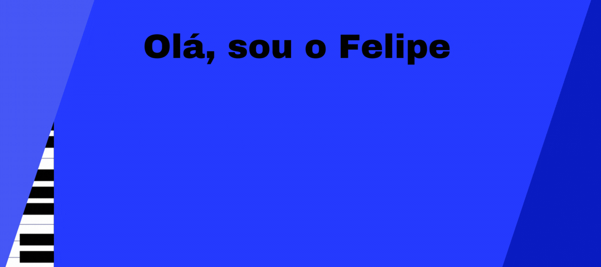

            I'm Hussain Abbas and I go by `hussainweb` online in most places. I have built, and more importantly, helped others build computer programs over the past two decades.

I work at [Axelerant](https://axelerant.com) and contribute to open source software (mostly Drupal) as part of my work and out of my own interest. I have a [longer README](https://hussainweb.github.io/README/) if you are interested in more about me.

---

Estatisticas

  
  

Ferramentas que estudo e conheço

#### Linguagens

### Frameworks e Ferramentas

## Contato

  

  
    
    

 
